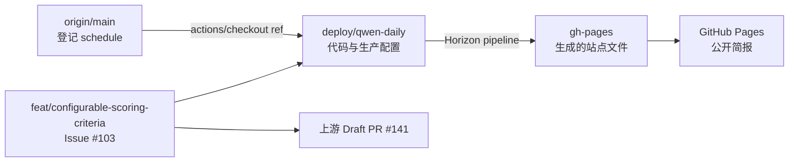

# Horizon Fork 项目状态与维护交接

> 维护对象：[`zlang8962-art/Horizon`](https://github.com/zlang8962-art/Horizon)
> 上游仓库：[`Thysrael/Horizon`](https://github.com/Thysrael/Horizon)
> 最后现场核实：2026-07-29 11:02（Asia/Shanghai）
> 当前生产分支：`deploy/qwen-daily`

以后接手本项目时，请先完整阅读本文件，再查看 `README_zh.md`、
`CONTRIBUTING.md`、相关配置和实时 Git/GitHub 状态。本文记录的是核实时的
快照，提交号、PR 状态、Actions 状态和上游差异都可能继续变化，不能代替
新的只读检查。

严禁在本文、Git、Actions 日志、Issue 或 PR 中记录 API Key 明文。本文只记录
Secret 名称。

## 1. 当前结论

| 项目 | 当前状态 | 证据/入口 |
|---|---|---|
| 每日简报工作流 | `active` | [Daily Horizon Summary](https://github.com/zlang8962-art/Horizon/actions/workflows/daily-summary.yml) |
| 自动运行时间 | 每天 23:15 UTC，即北京时间次日 07:15 | `origin/main:.github/workflows/daily-summary.yml` |
| 实际运行代码 | `deploy/qwen-daily@11c361652f8716da45144fb3ebad6a6f6e145126` | run #30410203162 的 Checkout 日志与远程分支复核 |
| 模型服务 | 智谱 GLM，`glm-4.7-flash`；思考模式关闭 | `data/config.github.json` |
| 用户 Secret | 当前使用 `ZHIPUAI_API_KEY`；旧 `DASHSCOPE_API_KEY` 保留回滚 | GitHub Actions repository secrets，仅核实名称 |
| 信息源规模 | GitHub 10 项；RSS 13 项（启用 12）；另有 HN、Reddit、Telegram、OSS Insight | `origin/deploy/qwen-daily:data/config.github.json -> sources` |
| 本地待部署增量 | 新增 Google News 定向检索、PandaBrief、工信部 RSS；分析失败率超过 50% 时中止发布 | 本地未提交差异；未改工作流或 Secret |
| 线上当前筛选 | 上一自然日（Asia/Shanghai）、5 个兴趣维度、`any`、分类配额、同一子来源最多 2 条、最终最多 12 条 | `origin/deploy/qwen-daily:data/config.github.json -> filtering` |
| 候选审计 | 已启用；Actions 附件保留 30 天，不发布到 Pages | run #30410203162 artifact `candidate-audit-30410203162-1` |
| 当前筛选版本 | `c35956bc1c243426205327796a4b80910ac4bba6`；2026-07-28 部署 | 自然日、同源限额、候选审计与文档测试 |
| Webhook | 关闭 | `data/config.github.json -> webhook.enabled: false` |
| LWN 订阅源 | 关闭 | `data/config.github.json -> sources.rss[name=LWN.net].enabled: false` |
| Pages | `built`，HTTPS 开启；当前提交 `f6116b44f7339410b3f2648c46061b43b139b838` | [简报首页](https://zlang8962-art.github.io/Horizon/) |
| 最近手动运行 | 自然日部署后仅触发 1 次；56 条抓取、27 日窗内 26 条、22 条分析失败、最终 4 条、13,808 Token | [run #30347633657](https://github.com/zlang8962-art/Horizon/actions/runs/30347633657) |
| Issue #103 功能 | 已实现，等待上游审阅 | [上游 Draft PR #141](https://github.com/Thysrael/Horizon/pull/141) |
| 最近自动定时运行 | 2026-07-29 首次以 GLM + 上海上一自然日组合成功：56 条抓取、窗内 38 条、分析失败 4/37、最终 8 条、67,540 Token | [run #30410203162](https://github.com/zlang8962-art/Horizon/actions/runs/30410203162) |

## 2. 仓库与分支拓扑



### 远程身份

- `origin`：`https://github.com/zlang8962-art/Horizon.git`
- `upstream`：`https://github.com/Thysrael/Horizon.git`
- Fork 默认分支：`main`

### 关键分支

| 分支 | 作用 | 核实提交 |
|---|---|---|
| `origin/main` | GitHub 默认分支；登记自动定时工作流并注入 GLM Secret | `80ccd44429561c2ed85a9633f57fee6fc9e834dd` |
| `origin/deploy/qwen-daily` | 实际运行代码、GLM 配置、筛选、审计与 Pages 部署逻辑 | `11c361652f8716da45144fb3ebad6a6f6e145126` |
| `origin/gh-pages` | Actions 自动生成的站点产物；不要手工编辑 | `f6116b44f7339410b3f2648c46061b43b139b838` |
| `origin/feat/configurable-scoring-criteria` | Issue #103 功能开发与上游 PR 来源 | `0bc408ae314b35fd3b84da94e3e9c363f2a96b78` |
| `origin/agent/enable-daily-summary` | 已合并 PR #2 的审计分支 | `7afd981b30d0823df9ab237aeed7b85fa8aee9a0` |

核实时，`origin/main` 相对 `upstream/main` 为：

- Fork 独有：7 个提交；
- 落后上游：49 个提交；
- 上游核实提交：`1e2fdc7ccb177f33c59aef2082c4093e1e82b22c`。

这是有意保留的历史状态。不要用 `git reset --hard`、强制 Push 或重写
`main` 来“对齐”上游。需要升级时，应在独立集成分支合并上游并完整验证。

本地 `main` 仍停在旧提交 `7a8e6a3`，比远程 `origin/main` 落后 7 个提交。
本次个性化筛选在独立分支 `codex/personalize-filtering-rules` 实施，基线为
`origin/deploy/qwen-daily@1616a9c4288d9ace8a9c94ea2d1a3be51414be43`，经用户
明确批准后以非强制快进方式部署。当前线上使用 5 个兴趣维度和最终 12 条上限。
不要把本地 `main` 或本文中的旧快照当成远程现状。

2026-07-28 17:54，自然日、候选审计和同源多样性修复已以非强制方式部署到
`deploy/qwen-daily@c35956b`。默认分支工作流通过
[Fork PR #4](https://github.com/zlang8962-art/Horizon/pull/4) 合并为 `80ccd44`，
并完成唯一一次真实运行 #30347633657。同步前的 1 行状态文件差异仍保存在可恢复的
`stash@{0}`，未删除或改写。

2026-07-29 07:15 后，当前 GLM + 上海上一自然日组合完成首次自动定时运行
#30410203162。远端 `main` 仍为 `80ccd44`，实际检出的生产分支现为 `11c3616`，
并由 Actions 生成 `gh-pages@f6116b4`。本地随后实现了信息源扩充和分析失败比例
保护，但截至本次核实尚未提交、Push 或触发真实模型运行。

## 3. 自动化如何工作

### 定时定义的唯一有效来源

GitHub 的 `schedule` 事件只读取默认分支，因此自动运行的有效定义是：

```text
origin/main:.github/workflows/daily-summary.yml
```

不要根据当前检出的 `deploy/qwen-daily:.github/workflows/daily-summary.yml`
判断实际定时时间；该分支中的工作流副本不是 GitHub 定时触发的来源。

远程 `main` 当前配置：

```yaml
on:
  schedule:
    - cron: "15 23 * * *"
  workflow_dispatch:
```

含义：

- 每天 23:15 UTC 发起；
- 对应北京时间次日 07:15；
- 选择第 15 分钟是为了避开 GitHub Actions 整点高负载；
- GitHub 仍可能延迟排队，不能把 07:15 当成严格的完成时间。

官方规则：
[Events that trigger workflows - schedule](https://docs.github.com/en/actions/reference/workflows-and-actions/events-that-trigger-workflows#schedule)。

### 运行路径

1. 默认分支上的工作流被定时或手动触发；
2. `actions/checkout@v6` 显式检出 `deploy/qwen-daily`；
3. 安装 Python 3.12、`uv 0.11.26` 和锁定依赖；
4. 将 `data/config.github.json` 复制为运行时 `data/config.json`；
5. 仅向 Horizon 注入当前生产 Secret `ZHIPUAI_API_KEY`；
6. 执行 `uv run horizon`，由生产配置选择 Asia/Shanghai 上一自然日；
7. 将 `docs/` 发布到 `gh-pages`；
8. 用 `actions/upload-artifact@v7` 上传脱敏候选审计，保留 30 天；
9. GitHub Pages 从 `gh-pages` 根目录构建站点。

上面是 17:54 通过 `origin/main@80ccd44`、`origin/deploy/qwen-daily@c35956b`
和真实运行 #30347633657 核实的**线上有效路径**。

`GITHUB_TOKEN` 是 GitHub 自动提供、用于写入 `gh-pages` 的内置令牌，不是
用户需要额外维护的模型 API Key。

### 重要依赖关系

- 不要删除或改名 `deploy/qwen-daily`，否则自动工作流无法检出代码；
- 不要手工修改 `gh-pages`，下一次部署可能覆盖手工内容；
- 修改 `deploy/qwen-daily` 会影响下一次自动运行，应先手动验证；
- 修改非默认分支中的 cron 不会改变真正的定时计划；
- 要改变定时计划，必须通过独立分支/PR 更新 `origin/main` 上的工作流。

## 4. 生产配置

配置文件：

```text
data/config.github.json
```

当前关键值：

| 字段 | 当前值 |
|---|---|
| `ai.provider` | `zhipu` |
| `ai.model` | `glm-4.7-flash` |
| `ai.base_url` | `https://open.bigmodel.cn/api/paas/v4` |
| `ai.api_key_env` | `ZHIPUAI_API_KEY` |
| `ai.max_tokens` | `8192` |
| `ai.thinking` | `disabled` |
| `ai.analysis_concurrency` / `ai.enrichment_concurrency` | `2` / `2` |
| `filtering.ai_score_threshold` | `8.0`（自定义维度启用时仅保留为兼容字段，不参与判定） |
| `filtering.filter_mode` | `any` |
| `filtering.score_criteria` | 5 个：AI/算力、软件构建、系统安全、芯片硬件、可操作价值 |
| `filtering.time_window_hours` | `24` |
| `filtering.time_window_mode` | `previous_calendar_day` |
| `filtering.time_window_timezone` | `Asia/Shanghai` |
| `filtering.max_items` | `12` |
| `filtering.max_items_per_sub_source` | `2` |
| `filtering.max_analysis_failure_ratio` | 远端当前未配置；本地候选值为 `0.5`，尚未部署 |
| `filtering.category_groups` | 4 组来源分类配额；其他来源最多 2 条 |
| `filtering.candidate_audit_enabled` | `true` |
| GitHub 来源 | 10 项（1 个用户事件、9 个项目 Release） |
| RSS 来源 | 13 项，其中 12 项启用、LWN 关闭 |
| OSS Insight | 启用；24 小时、最多 12 项、最低 30 Stars、关键词过滤 |
| `webhook.enabled` | `false` |
| LWN `enabled` | `false` |

上表描述的是远端 `deploy/qwen-daily` 的当前生产配置。GLM 接入与运行参数来自
提交 `7032fbd506435067f98d2badd3b1e17bedd08f4b`；个性化筛选逻辑来自配置提交
`a817bc3085630cfb31a3c285a7da344fbb3f0bbe`；自然日、同源限额和审计来自
`c35956bc1c243426205327796a4b80910ac4bba6`。

### 已部署的自然日、同源限额与候选审计配置

以下增量已在 `c35956b` 上线，并由默认分支 PR #4 与真实运行 #30347633657 验证：

| 字段 | 生产值 | 作用 |
|---|---|---|
| `filtering.time_window_mode` | `previous_calendar_day` | 使用上一自然日，而不是运行时点向前 24 小时 |
| `filtering.time_window_timezone` | `Asia/Shanghai` | 28 日简报覆盖 27 日 00:00-23:59（北京时间） |
| `filtering.max_items_per_sub_source` | `2` | 同一仓库、RSS、Subreddit、频道等最多入选 2 条 |
| `filtering.candidate_audit_enabled` | `true` | 保存每个候选的分数、去留和原因 |

实现细节：

- 自然日窗口采用起点包含、终点不包含的 `[00:00, 次日 00:00)`，转换成 UTC
  后抓取并再次做上界校验；显式 `--hours N` 仍保留滚动窗口语义；
- 报告文件仍按生成日命名，例如 `2026-07-28-summary-zh.md`，正文明确标注
  “报道范围：2026-07-27（Asia/Shanghai 自然日）”，条目时间也转成上海时间；
- 审计写入 `data/audits/YYYY-MM-DD-candidate-audit.json`，只记录标题、移除查询
  参数和凭据后的 URL、来源、时间、分数与去留原因，不保存文章正文或 Secret；
- 工作流候选使用官方 `actions/upload-artifact@v7` 保存审计 30 天，不复制到
  GitHub Pages。仓库是公开仓库，Actions 附件不能当作秘密保险箱，因此审计格式
  本身仍按公开可见数据设计；
- 默认分支工作流继续保持 07:15 定时，并已改为 `uv run horizon`；真实运行确认
  GitHub 正确解析了工作流、自然日配置和审计上传步骤。

### 旧筛选链（2026-07-27 个性化部署前）

1. **时间范围**：只处理运行时点向前 24 小时内的内容。
2. **来源内预筛选**：
   - Hacker News：读取 Top 30，社区分数至少 150；
   - Reddit：`MachineLearning` 与 `LocalLLaMA`，`hot/day`，每个最多 10 条，
     社区分数至少 60，并读取最多 10 条评论；
   - Telegram：`zaihuapd`，最多 20 条；
   - OSS Insight：`past_24_hours`、全部语言，按 AI/LLM、推理、Agent、
     编译器、分布式系统、安全、可观测性等关键词匹配，最低 30 Stars，
     最多 12 条；
   - GitHub 项目 Release、用户事件和启用的 RSS 均继续受 24 小时时间窗约束。
3. **跨来源合并**：先合并指向相同 URL 的重复内容。
4. **AI 评分**：Qwen 对每条候选给出 0-10 分重要性评分，综合考虑技术深度与
   新颖性、潜在影响、写作/呈现质量、与软件工程、AI/ML、系统研究的相关性，
   以及社区讨论和互动信号。
5. **通过门槛**：`ai_score >= 8.0`，等于 8.0 也通过；未评分、字段无效或模型
   输出解析失败的条目会记录 `ai_analysis_error` 并明确排除，不会静默记为 0 分。
6. **主题去重**：对通过门槛的内容再做语义主题去重，只保留同一事件的主要条目。
7. **最终数量**：当前没有配置 `max_items` 或分类配额，因此主题去重后不再按
   固定总数截断；实际发布条数取决于当天达到 8 分的内容数。

### 当前个性化筛选链

来源内预筛选后严格保留 Asia/Shanghai 上一自然日，随后做跨来源 URL 合并和主题
去重。AI 判定同时输出以下 5 个独立分数：

| 维度 | 通过门槛 | 个性化重点 |
|---|---:|---|
| `ai_compute` | `>= 8.0` | AI/ML 模型、Agent、训练与推理、评测与安全、开源模型生态和算力基础设施 |
| `software_building` | `>= 8.0` | 软件工程、开发工具、语言与框架、开源发布、移动/Web、local-first 与数据型应用、可维护工作流 |
| `systems_security` | `>= 8.0` | Windows/Linux、系统排障、云原生与分布式系统、网络、可观测性、可靠性、性能、安全、隐私与数据保护 |
| `chips_hardware` | `>= 8.0` | 半导体、GPU/AI 加速器、内存与互连、架构、制造和软硬件协同 |
| `practical_value` | `>= 8.5` | 可复现、有证据、说明权衡且保护数据的排障、维护、迁移、安全或改进方法；压低泛泛建议和推广内容 |

候选使用 `filter_mode: any`：任一维度达到自己的门槛即可保留，等于门槛也通过；
用于排序和展示的聚合 `ai_score` 取 5 个维度中的最高分。模型缺少、多出或返回
无效维度时，该条目保持未评分，记录 `ai_analysis_error` 并明确排除。

主题去重后再按**来源分类**执行配额（不是按上述评分维度配额）：

- AI 与算力来源最多 6 条；
- 软件与开发工具来源最多 4 条；
- 系统与安全来源最多 4 条；
- 芯片与硬件来源最多 3 条；
- 未归类来源最多 2 条；
- 所有来源合计最多 12 条。

配置描述只使用一般兴趣主题，没有写入个人项目名、本地路径、设备信息或私人数据。
5 维评分会比单一评分产生略多模型输出；最终 12 条上限可以控制后续内容增强和
简报篇幅，但不会减少候选内容的第一轮评分调用。

分类配额后还执行 `max_items_per_sub_source: 2`：同一仓库、RSS、Subreddit、频道或
站点最多入选 2 条，后续候选可回填。run #30347633657 实测最终两个子来源各 2 条，
确认该上限已生效；但本次大量 AI 限流使可选候选只有 4 条，不能据此判断长期多样性。

配置说明：

- [配置指南](docs/configuration.md)
- [评分机制](docs/scoring.md)

### Secret 管理

仓库当前使用并需要维护的生产 Secret 是：

```text
ZHIPUAI_API_KEY
```

`DASHSCOPE_API_KEY` 仍保留在仓库中，只作为回滚到 Qwen 的路径；当前工作流不读取
它。2026-07-28 15:29 的只读核查确认两个名称均存在，没有读取或记录任何 Secret
值。

查看名称：

```powershell
gh secret list --repo zlang8962-art/Horizon
```

更换密钥时应在 GitHub 仓库：

```text
Settings
  -> Secrets and variables
  -> Actions
  -> Repository secrets
```

轮换当前 GLM 密钥时保持 `ZHIPUAI_API_KEY` 名称不变。不要把值写入 `.env` 后
提交，也不要通过命令输出、截图或 PR 正文传递密钥。

## 5. Issue #103：可配置评分维度

需求：

- [Issue #103](https://github.com/Thysrael/Horizon/issues/103)
- [Draft PR #141](https://github.com/Thysrael/Horizon/pull/141)

核实时 PR #141：

- 状态：`OPEN`、`Draft`；
- 合并状态：`MERGEABLE/CLEAN`；
- Head：`0bc408ae314b35fd3b84da94e3e9c363f2a96b78`；
- GitHub 当前未报告 CI checks 或 review decision。

已实现语义：

- 未配置 `score_criteria` 或设为 `null`：保留旧提示、旧解析和
  `ai_score_threshold` 行为；
- 单一或多个维度：每个维度有稳定名称、说明和 0-10 阈值；
- `any`：任一维度分数 `>=` 对应阈值即保留；
- `all`：全部维度分数 `>=` 对应阈值才保留；
- 阈值相等视为通过；
- 显式空列表无效；
- 名称按大小写不敏感去重，并限制为稳定 ASCII 标识符；
- 阈值必须是 0-10 之间的有限数值；
- 未知过滤模式无效；
- 模型缺字段、多字段、类型错误、越界、非有限值或无效 JSON 时，条目保持
  “未评分”，记录 `ai_analysis_error` 并在过滤阶段明确排除；
- 解析或提供商失败不会被静默改成低分或 0 分。

核心文件：

```text
src/models.py
src/scoring.py
src/ai/prompts.py
src/ai/analyzer.py
src/orchestrator.py
src/mcp/service.py
tests/test_configurable_scoring.py
tests/test_analyzer.py
tests/test_mcp_service_smoke.py
docs/configuration.md
docs/scoring.md
data/config.example.json
README.md
```

## 6. 已验证的真实运行

### 2026-07-29 首次 GLM 自然日自动定时运行

- Actions：
  [run #30410203162](https://github.com/zlang8962-art/Horizon/actions/runs/30410203162)；
- 事件：`schedule`；2026-07-29 00:08:02Z 创建，00:12:15Z 完成，结论为
  `success`；默认分支入口为 `main@80ccd44429561c2ed85a9633f57fee6fc9e834dd`，
  实际生产分支为 `deploy/qwen-daily@11c361652f8716da45144fb3ebad6a6f6e145126`；
- 报道日为 2026-07-28（Asia/Shanghai）：顶层抓取 56 条，精确自然日内 38 条，
  跨来源合并后 37 条进入分析；其中 4 条分析失败、8 条最终入选，失败比例为
  `4/37 = 10.81%`；
- 最终来源分布为 `llama.cpp` 2 条、Hacker News 1 条、Reddit 1 条、GitHub Blog
  1 条、Simon Willison 1 条、Telegram 2 条；芯片硬件组本次仍为 0 条，因此
  工作流成功不等于国内芯片覆盖已经解决；
- Token 为 67,540（输入 57,219、输出 10,321），全部归于 `zhipu`。这是可用的
  正常运行样本，但实际余额和资源包扣减仍只能以智谱账号后台为准；
- 候选审计附件为
  [`candidate-audit-30410203162-1`](https://github.com/zlang8962-art/Horizon/actions/runs/30410203162/artifacts/8708151725)，
  ID `8708151725`、大小 6,138 字节、SHA-256 digest
  `9f204fc012ab79a3d7aa08f6cb953d1b537527459de26fd81b159d3303fcd733`，
  预计 2026-08-28 00:12:12Z 到期；
- `gh-pages` 更新为 `f6116b44f7339410b3f2648c46061b43b139b838`。本地候选的
  50% 失败率保护若已部署会放行本次 10.81% 的正常波动；而 2026-07-28 手动运行
  的 22/26（84.62%）会在发布前被阻止。

### 自然日、候选审计与同源限额部署后真实运行

- Actions：
  [run #30347633657](https://github.com/zlang8962-art/Horizon/actions/runs/30347633657)
- 事件：`workflow_dispatch`；部署后仅触发 1 次，运行列表确认没有重复触发；
- 触发入口：默认分支 `main@80ccd44429561c2ed85a9633f57fee6fc9e834dd`；
- 实际检出：`deploy/qwen-daily@c35956bc1c243426205327796a4b80910ac4bba6`；
- 时间：2026-07-28 09:41:19Z 至 09:47:57Z；任务约 6 分 33 秒；
- 结论：`success`；Horizon、Pages 和候选审计上传全部成功。

时间窗与抓取：

- 报道日为 2026-07-27（Asia/Shanghai），精确 UTC 窗口为
  `[2026-07-26T16:00:00Z, 2026-07-27T16:00:00Z)`；
- 顶层共抓取 56 条：GitHub 17、Hacker News 9、RSS 6、Reddit 6、Telegram 18、
  OSS Insight 0；精确自然日二次校验排除 30 条，留下 26 条；
- PyTorch Blog 仍返回 403；Reddit HTML/JSON 被阻断后降级，`LocalLLaMA` RSS 仍为
  429；OSS Insight 请求成功但返回 0 条。

GLM 分析与生成：

- 26 条均进入分析，但 22 条重试后仍为 `RetryError`；日志明确出现 HTTP 429、
  智谱错误码 `1305`“该模型当前访问量过大，请您稍后再试”，这是本次服务限流证据，
  不能写成账号额度已耗尽；
- 只有 4 条取得有效评分，4 条均命中 `any`；主题去重也遇到 429 后按设计跳过；
- 最终 4 条为 `llama.cpp` 2 条、Telegram 2 条，同一子来源上限 2 条已生效；
- 两条内容增强再次因 429 失败，按设计降级为翻译；中英文简报仍成功生成；
- Token 为 13,808（输入 11,776、输出 2,032），全部归于 `zhipu`。该低用量主要
  来自 22 条分析失败，不能当作正常日均成本样本。

候选审计：

- Actions artifact：`candidate-audit-30347633657-1`，ID `8683714752`，SHA-256
  digest `6773e5722933ab8e2cd0196c4fa129566d9f2a9c9531c55bc037e45c462c113d`，
  到期时间 2026-08-27 09:47:52Z；
- 审计状态 `completed`；56 条记录的原因统计为 `outside_window=30`、
  `analysis_failed=22`、`selected=4`；
- 审计中没有任何标题匹配“长鑫、长信、CXMT、上市、IPO”。因此“长鑫存储上市”
  本次是**现有信息源没有抓到**，不是评分阈值、主题去重或配额淘汰；
- 审计 URL 查询参数计数为 0，候选对象没有正文、body、Secret、API Key 或 token
  字段，原始文本也没有测试正文或常见凭据标记。

Pages 与内容：

- `gh-pages` 提交 `3493302e9cb74b5d77c98aa53158df3a75a3e049`；Pages 状态
  `built`，2026-07-28 09:48:28Z 完成，`error.message: null`；
- 中英文远程 Markdown 都声明 `content_date: 2026-07-27` 和自然日报道范围，均为
  26 选 4；没有空简报占位、`undefined`、`null` 或分析失败文本；
- [2026-07-28 中文简报](https://zlang8962-art.github.io/Horizon/2026/07/28/summary-zh.html)
  和 [英文简报](https://zlang8962-art.github.io/Horizon/2026/07/28/summary-en.html)
  均从公开网络返回 HTTP 200，并显示 27 日覆盖和 4 条结果；
- 中文页中的 `CXMT` 只出现在“三星考虑采用中国低价 DRAM 芯片”条目的背景参考
  链接中，不是“长鑫存储上市/IPO”新闻。

非阻塞告警：`actions/setup-python@v5` 与 `astral-sh/setup-uv@v6` 仍触发 Node.js 20
弃用提示，GitHub 当前强制用 Node.js 24 执行；本次没有阻塞。

### GLM-4.7-Flash 首次真实运行（历史基线）

- Actions：
  [run #30338619633](https://github.com/zlang8962-art/Horizon/actions/runs/30338619633)
- 事件：`workflow_dispatch`；仅手动触发 1 次，没有重复运行；
- 触发入口：默认分支 `main@d04d767edba154997285301fe878662ac8a33019`；
- 实际检出：`deploy/qwen-daily@7032fbd506435067f98d2badd3b1e17bedd08f4b`；
- 时间：2026-07-28 07:29:36Z 至 07:34:37Z；任务耗时约 4 分 56 秒；
- 结论：`success`；Horizon 生成和 Pages 部署步骤均成功。

真实抓取结果：

| 顶层来源 | 候选数 | 现场情况 |
|---|---:|---|
| GitHub | 11 | 成功 |
| Hacker News | 6 | 成功 |
| RSS | 5 | PyTorch Blog 返回 403，其余本次入库 5 条 |
| Reddit | 6 | HTML 403、JSON 被阻断后降级；`LocalLLaMA` RSS 返回 429 |
| Telegram | 14 | 成功 |
| OSS Insight | 0 | 请求成功，本次没有符合来源预筛选的条目 |
| **合计** | **42** | 顶层流程没有整体失败 |

GLM 分析和生成结果：

- 42 条均进入 AI 分析；4 条在重试后仍返回 `RetryError`，保留
  `ai_analysis_error` 并明确排除；其余 38 条得到有效评分；
- 24 条命中 `filter_mode: any`，来源分类配额和平衡逻辑最终选出 11 条；
- 11 条均完成背景增强并生成中英文简报；Token 为 92,467（输入 78,443，
  输出 14,024），日志将全部用量归于 `zhipu`；
- 空简报保护未触发；如果未来全部候选 AI 分析失败，工作流会在发布前失败，
  不会用错误的“无重要动态”覆盖旧 Pages；
- 最终 11 条中有 6 条是 `llama.cpp` 的相邻版本发布，说明当前主题去重和分类
  配额没有限制同一项目的连续版本；这是内容多样性问题，不是 GLM 调用失败；
- “长鑫/长信存储、CXMT、上市、IPO”未出现在最终简报或运行日志。日志没有保留
  全部 42 个候选标题，因此尚不能区分该事件是未被信息源抓到，还是评分后被淘汰；
  此外，本次手动窗口为北京时间约 2026-07-27 15:29 至 2026-07-28 15:29，
  27 日更早的消息本来就不在本次候选范围内。

Pages 与内容完整性验证：

- `gh-pages` 新提交：`ea3024de08c1bc8b70cdcfe920511592c4077458`；
- Pages 最新构建状态为 `built`，对应上述提交，2026-07-28 07:35:13Z 完成且
  `error: null`；
- 新增 `_posts/2026-07-28-summary-zh.md` 和
  `_posts/2026-07-28-summary-en.md`；两份均为 11 条，分别约 10,236 和
  16,954 个字符；
- 两份 Markdown 均没有空简报占位、`undefined`、`null` 或分析失败文本；标题、
  日期、语言、目录、11 个正文段和外链结构均存在；
- [2026-07-28 中文简报](https://zlang8962-art.github.io/Horizon/2026/07/28/summary-zh.html)
  和 [英文简报](https://zlang8962-art.github.io/Horizon/2026/07/28/summary-en.html)
  均已从公开网络返回 HTTP 200；中文页实测包含“42 选 11”和抽样条目，英文页
  的 HTML 实体标题也能正常渲染；
- 中文页 `Last-Modified` 为 2026-07-28 07:35:12Z，确认公开站点已刷新到本次
  GLM 产物，而不是旧缓存。

非阻塞告警：`actions/setup-python@v5` 与 `astral-sh/setup-uv@v6` 仍声明 Node.js
20，GitHub 当前强制用 Node.js 24 执行；本次全部步骤成功，但应在后续独立维护中
升级或观察这些 Action。

### 个性化筛选首次真实运行

- Actions：
  [run #30234414815](https://github.com/zlang8962-art/Horizon/actions/runs/30234414815)
- 事件：`workflow_dispatch`；仅手动触发 1 次，没有重复运行；
- 触发入口：默认分支 `main@f03016c72c6e826e5bc37cdf2cb0d00cced2e98c`；
- 实际检出：`deploy/qwen-daily@d937393a9fb0f2a046f325a30bf27583031fb54f`；
- 时间：2026-07-27 03:21:30Z 至 03:30:26Z；
- 结论：`success`，Horizon 生成和 Pages 部署步骤均成功。

真实抓取结果：

| 顶层来源 | 候选数 | 现场情况 |
|---|---:|---|
| GitHub | 4 | 成功 |
| Hacker News | 11 | 成功 |
| RSS | 1 | 其余启用源在 24 小时窗内无内容或未入库；PyTorch Blog 返回 403 |
| Reddit | 7 | `MachineLearning` 通过 RSS 降级取得内容；两个旧版 HTML 请求 403，`LocalLLaMA` RSS 429 |
| Telegram | 14 | 成功 |
| OSS Insight | 0 | 请求成功，但本次没有符合来源预筛选的条目 |
| **合计** | **37** | 顶层来源没有整体失败 |

个性化筛选和生成结果：

- 37 条均进入 AI 分析，22 条命中 `any` 评分规则；
- 1 条 Hacker News 内容因模型响应缺少必填 `tags` 字段，保持未评分并带
  `ai_analysis_error`，随后被明确排除；
- 主题去重移除 1 条，剩余 21 条；
- 来源分类配额最终选出 10 条：AI 与算力 6/6，软件与开发工具 4/4，
  系统与安全 0/4，芯片与硬件 0/3，其他 0/2；
- 最终来源：GitHub 3 条、Hacker News 2 条、Reddit 2 条、RSS 1 条、
  Telegram 2 条；
- 10 条均完成背景增强，生成中英文简报；
- 中文第 8 条医学模型资讯的正文尾句不完整，发布后的原始 Markdown 确认停在
  “作者还展示了 S-GRPO 论文中的”；工作流成功只证明流水线完成，不能替代
  内容完整性检查；英文同一条正文完整；
- Token：189,217（输入 75,909，输出 113,308）。相较上一轮定时运行的
  71,945 Token，本次约为 2.63 倍；但信息源扩充和 5 维评分同时生效，不能把
  增幅只归因于其中一项。

Pages 验证：

- `gh-pages` 新提交：`2d5df98ab08fee290b0f5218a69d188ba7d6159e`；
- 修改 `_posts/2026-07-27-summary-zh.md` 和
  `_posts/2026-07-27-summary-en.md`；
- Pages 构建状态：`built`，完成于 2026-07-27 03:30:55Z；
- [2026-07-27 中文简报](https://zlang8962-art.github.io/Horizon/2026/07/27/summary-zh.html)
  已在应用内浏览器打开并核对：页面、标题、37→10 统计和 10 条内容结构均可
  显示；第 8 条正文存在上述生成截断；
- [2026-07-27 英文简报](https://zlang8962-art.github.io/Horizon/2026/07/27/summary-en.html)
  的远程 Markdown 和 Pages 提交已验证，未单独做浏览器视觉复核。

### 自动定时运行

- [run #30180747028](https://github.com/zlang8962-art/Horizon/actions/runs/30180747028)：
  2026-07-26 定时触发并成功；抓取和分析 28 条，2 条达到 8.0；生成中英文
  简报；使用 79,303 Token（输入 27,875，输出 51,428）。
- [run #30226855537](https://github.com/zlang8962-art/Horizon/actions/runs/30226855537)：
  2026-07-27 定时触发并成功；抓取和分析 31 条，1 条达到 8.0；生成中英文
  简报；使用 71,945 Token（输入 25,270，输出 46,675）。
- 两次运行均由默认分支的 `schedule` 触发，并显式检出
  `deploy/qwen-daily`；第二次定时运行当时生成的 Pages 提交为
  `0568c2608038f8465040b2b820dc2a7428c20923`，当前站点已由后续手动运行更新。

以上两次定时运行使用的是来源扩充前的配置。来源扩充和个性化筛选已由
run #30234414815 完成首次真实模型与 Pages 集成验证；自动 `schedule` 路径在
新配置下是否长期稳定，仍需观察后续定时运行。

### 首次手动成功运行

- Actions：
  [run #30152546088](https://github.com/zlang8962-art/Horizon/actions/runs/30152546088)
- 事件：`workflow_dispatch`
- 分支：`deploy/qwen-daily`
- 提交：`43b3c353944f0a7b4ec144dc5de671a1ea177d86`
- 时间：2026-07-25 09:16:56Z 至 09:24:26Z
- 结论：`success`

运行结果：

- 抓取 38 条；
- 合并 1 条跨来源重复，剩余 37 条；
- 9 条评分达到 8.0；
- 3 条模型响应校验失败，保持未评分并带诊断信息；
- 主题去重后发布 8 条；
- 生成中英文 Markdown；
- 成功 Push 到 `gh-pages`；
- 模型 Token：147,039
  （输入 53,304，输出 93,735；实际计费/免费额度口径以平台为准）。

生成文件包括：

```text
data/summaries/horizon-2026-07-25-zh.md
data/summaries/horizon-2026-07-25-en.md
docs/_posts/2026-07-25-summary-zh.md
docs/_posts/2026-07-25-summary-en.md
```

Pages 产物提交：

```text
ea304fdf7bb475ce41e79699a037a7f0bbe7a2c2
```

站点：

- [简报首页](https://zlang8962-art.github.io/Horizon/)
- [2026-07-25 中文简报](https://zlang8962-art.github.io/Horizon/2026/07/25/summary-zh.html)

### 首次失败及修复

- 失败运行：
  [run #30151276487](https://github.com/zlang8962-art/Horizon/actions/runs/30151276487)
- 原因：工作流把空的 `HORIZON_WEBHOOK_URL` 注入运行环境，而配置启用了
  Webhook，导致模型调用前失败；
- 修复提交：`43b3c353944f0a7b4ec144dc5de671a1ea177d86`；
- 修复：关闭 Webhook 与 LWN，工作流只保留 `DASHSCOPE_API_KEY`；
- 修复后真实运行通过。

## 7. 已执行的本地验证

### 2026-07-29 国内半导体来源与部分失败发布保护（本地待部署）

本次变更只存在于本地 `deploy/qwen-daily` 工作区：没有修改 GitHub Actions
工作流或 Secret，没有提交、Push、发布 Pages，也没有调用 GLM 或消耗模型额度。

实现范围：

- 生产候选配置新增 Google News 中文区定向检索，关键词覆盖长鑫科技/长鑫存储、
  CXMT、长江存储、YMTC、国产半导体和芯片 IPO，并排除常见加密货币噪音；来源
  分类为 `semiconductors`，抓取上限为 100；
- RSS 新增 [PandaBrief](https://pandabrief.com/) 中国半导体周报和
  [工信部 RSS](https://www.miit.gov.cn/RRSdy/)“工信动态”。工信部接口使用
  13 位 Unix 毫秒时间戳，因此 RSS 解析器补充了秒/毫秒时间戳兼容；
- 未启用 GDELT：本次公开接口现场请求返回 HTTP 429，不能把不稳定的验证结果
  当成可靠生产来源；Google News 同样只作为无 Key 的补充聚合入口，不是官方
  公告的替代品；
- `filtering.max_analysis_failure_ratio` 本地设为 `0.5`。只要失败比例严格超过
  50%，运行就在筛选、内容增强、摘要和 Pages 输出前失败；全部失败保护继续保留。
  候选审计新增失败数、实际失败比例、配置上限和
  `ai_analysis_failure_ratio_exceeded` 状态；
- Google News 抓取器现在先按 `since` 剔除过期条目，再计算 `max_results`，避免
  旧新闻先占满上限、把目标自然日新闻挤掉。

只读来源回放（2026-07-29 执行，固定复核 2026-07-27 上海自然日）：

- Google News：从 `since` 起解析到 100 条，上述精确自然日内 6 条，其中明确
  命中“CXMT 上海上市交易首日”的一财全球标题；这说明此前漏报可在候选入口被
  补上，但历史回放不等同于 7 月 28 日 07:15 当时的实时结果；
- 工信部：从 `since` 起 3 条，精确自然日内 1 条，毫秒时间戳解析成功；
- PandaBrief：订阅源可访问，但该精确自然日内为 0 条；其长鑫上市预告发布在
  7 月 25 日，因此会作为前瞻补充，不能单独保证“事件发生日”覆盖；
- 抓取后的自然日上界过滤仍在模型分析之前执行，回放中的 100 条不是 100 次 GLM
  调用。实际调用量取决于目标日条数、跨来源合并和运行时来源状态。

验证结果：

- `data/config.example.json` 与 `data/config.github.json` 的 JSON/Pydantic 加载通过，
  `git diff --check` 通过；
- 新增来源、日期解析、失败比例、候选审计、配置和 MCP 聚焦测试：64 项通过；
- 排除本机 DNS 会让 SSRF 防护提前拒绝 `example.com` 的
  `tests/test_webhook.py` 与 `tests/test_extractors_trafilatura.py` 后，其余 320 项
  全部通过；
- 完整测试仍有上述 21 项环境相关失败（Webhook 20 项、Trafilatura 1 项），
  不能写成全套测试全绿；
- 仍待验证：GitHub Actions 网络环境下三个新增来源的长期稳定性、一次真实 GLM
  运行的候选量/Token/正文质量，以及失败率保护在远端的实际中止与旧 Pages 保留。

当前工作区共有 19 个跟踪文件包含上述代码、配置、文档、测试和本状态文件的未提交
改动；部署前必须再次复核差异，并取得对提交、非强制 Push 和真实模型运行范围的
明确授权。

### 2026-07-28 MiMo-V2.5 可行性核查

本次只核查本地接入条件和 Xiaomi MiMo 官方资料，没有修改生产模型、GitHub
Secret、Actions 工作流或线上 Pages，也没有发起真实 MiMo 模型调用。

- 结论：`mimo-v2.5` 的能力和限流足以承担当前 5 维评分、JSON 解析、主题去重、
  双语内容增强任务；官方支持 OpenAI 兼容 Chat Completions、JSON 模式，限流为
  100 RPM / 10M TPM，明显高于当前并发 5 的工作负载。
- 接入：当前代码可先将 MiMo 配成通用 `openai` provider，使用
  `https://api.xiaomimimo.com/v1` 和独立环境变量名；项目未原生登记 `mimo`
  provider，若要加入 provider chain 自动回退，建议先补原生 provider 或修正链式
  配置对自定义 Key/Base URL 的继承。
- 兼容风险：MiMo-V2.5 Chat Completions 默认开启深度思考；当前客户端没有发送
  `thinking: {"type": "disabled"}`，因此 `temperature: 0.3` 会被服务端忽略，且
  推理 token 可能增加成本。正式切换前应增加可配置开关，并分别验证评分和长摘要。
- 免费与价格：MiMo 文本 API 已于 2026-01-26 开始计费，不是永久免费的 API；
  官方当前说明为新注册赠送 ¥10 体验金。`mimo-v2.5` 按缓存未命中输入
  ¥1/MTok、输出 ¥2/MTok 计费。
- 工作量估算：按 run #30234414815 的 75,909 输入 / 113,308 输出 token 直接
  换算约 ¥0.30/次、¥9.08/30 天；线性外推到 45 条候选约 ¥0.37/次、
  ¥11.04/30 天。该估算未计不同 tokenizer、深度思考 token、重试和候选量波动，
  ¥10 体验金约可覆盖 27-33 次类似运行，而不是长期免费。
- 未验证：尚未用 MiMo API 对 Horizon 的真实样本做 JSON 成功率、评分一致性、
  中文完整性、延迟、Token 和故障回退测试。生产切换前应先跑固定样本 A/B，再做
  一次手动完整运行并检查内容，而不能只以工作流绿色状态作为验收。

### 2026-07-28 免费/低成本替代模型核查

本次只核查官方文档并按最近完整运行约 66 次 API 请求、189,217 Token/天估算，
没有注册账号、调用模型、修改生产配置、Secret、工作流权限或线上 Pages。

1. `glm-4.7-flash`：当前首选免费替代。智谱官方将其列为免费模型；支持
   OpenAI 风格 Chat Completions、200K 上下文、JSON Object、函数调用和思考模式，
   中文及长文本能力与 Horizon 更匹配。正式接入仍需在账号控制台确认实时限流，
   并先以并发 1-2 做固定样本 A/B；免费政策和模型可用性可能调整。
2. GitHub Models `openai/gpt-4o-mini`：免费 Low 档为 15 RPM、150 请求/天、
   8K 输入、4K 输出；当前约 66 请求/天可覆盖。GitHub Actions 可用内置
   `GITHUB_TOKEN`，但必须新增 `models: read` 工作流权限，并把单次输出上限降至
   4096 以内。该服务仍是免费公共预览，不宜作为唯一生产来源；权限尚未申请。
3. Cerebras `gpt-oss-120b`：免费档 30 RPM、1M Token/小时和 1M Token/天，
   容量足够，且支持 OpenAI 兼容接口和结构化 JSON；但免费上下文仅 8,192 Token，
   当前 `max_tokens: 8192` 必须降到约 3,072-4,096，并需实测中文简报质量。
4. Gemini 2.5 Flash/Flash-Lite：官方免费档且支持 OpenAI 兼容与结构化输出，
   但免费档地区可用性、账号实际限额和数据用于改进产品的政策使其不适合作为当前
   首选；中国大陆注册与调用可用性尚未验证。
5. 硅基流动免费 4B-9B 模型：可承担低风险初筛，但不建议独立负责 5 维评分、
   双语背景增强和最终摘要。OpenRouter 零付费账号仅 50 请求/天，Groq 免费档
   仅约 200K Token/天，均不足以给最近一次 66 请求、189K Token 的运行留出重试
   余量；百度千帆 1M Token 为限期新用户额度，旧腾讯混元 Lite 已退役。

该表是选择前的研究快照。用户曾短暂选择 DeepSeek V4-Pro，但在任何提交、推送、
Secret 修改、API 调用或费用发生前撤回；随后已部署 GLM-4.7-Flash，部署证据见
下节。

### 2026-07-28 DeepSeek V4-Pro 切换尝试（已撤回）

本地曾准备 `deepseek-v4-pro` 配置并完成 76 项离线测试，但没有接收或写入 Key、
没有调用 DeepSeek、没有产生费用、没有提交或推送，也没有修改线上 Secret、Actions
或 Pages。随后相关生产配置与测试改动已撤回，不再作为当前部署方案。

### 2026-07-28 自然日、候选审计与同源多样性修复（已部署并真实验证）

本次针对“28 日简报应完整报道 27 日”以及 `llama.cpp` 连续占位问题完成实现，
并经明确授权提交、非强制 Push、PR 合并、一次真实 GLM 运行和 Pages 验证：

- 新增 `rolling_hours` / `previous_calendar_day` 两种时间窗；生产候选使用
  `Asia/Shanghai` 上一自然日，`--hours` 继续显式覆盖为滚动窗口；
- 自然日模式在所有来源抓取后再次应用排他的结束时间，避免来源只支持 `since`
  时混入当天内容；报告生成日、报道日和展示时区分别记录；
- 新增每个子来源最多 2 条的限制；排序更高的两条保留，后续同项目条目记录
  `sub_source_limit`，其他来源可以补足总条数；
- 新增原子写入的候选审计，覆盖 `outside_window`、跨来源重复、AI 失败、低于阈值、
  主题重复、二次过滤、分类配额、同源配额、总量上限和最终入选等原因；
- 审计不保存正文，URL 删除查询参数、片段和凭据；候选工作流使用官方
  [`actions/upload-artifact@v7`](https://github.com/actions/upload-artifact) 保留 30 天，
  不把审计复制到 Pages；
- 中英文摘要兼容旧调用；自然日报告会显示报道日期，并按配置时区显示条目时间；
- 示例配置、CLI 模板、README、配置指南、评分说明和本文已同步维护。

本地验证：

- Python 语法编译、两个 JSON 文件的 Pydantic 加载和 `git diff --check`：通过；
- 时间窗、审计、同源限额、失败路径、摘要显示和 MCP 最终聚焦回归：51 项通过；
- 存储、评分、MCP 和现有运行链定向回归：90 项通过；这些集合有重叠，不能相加
  当作唯一测试数；
- 完整测试：403 项通过、21 项失败。失败仍是 `tests/test_webhook.py` 20 项和
  `tests/test_extractors_trafilatura.py` 1 项；本机将 `example.com` 解析到保留地址
  `198.18.0.4`，SSRF 防护在 Mock 请求前按设计拒绝；
- 排除上述两个受 DNS 环境影响的文件后：311 项全部通过；
- 仅有 1 条 Google GenAI 第三方弃用警告；本地未安装 YAML 专用解析器，但 GitHub
  已在 run #30347633657 实际解析并成功执行全部工作流步骤；
- 本次提交前再次复跑当前五个聚焦测试文件：46 项全部通过。首次在受限沙箱临时
  目录内复跑出现权限错误，不是断言失败；改在沙箱外独立临时目录后通过；
- 部署提交：`c35956bc1c243426205327796a4b80910ac4bba6`；默认分支工作流提交
  `1a8300dba9f47fd6a1ffdb4eafe595c8a7fb84bf`，经
  [Fork PR #4](https://github.com/zlang8962-art/Horizon/pull/4) 合并为
  `80ccd44429561c2ed85a9633f57fee6fc9e834dd`；
- 真实验证发现两个新的生产问题：现有信息源没有抓到“长鑫存储上市”，且 GLM
  对 26 条自然日候选中的 22 条返回 429/1305 限流。修复本身已上线，但当日简报
  质量不能判为完全通过。

### 2026-07-28 GLM-4.7-Flash 切换与首次生产验证（已完成）

已部署并完成一次真实运行：

- 新增原生 `zhipu` Provider，默认模型 `glm-4.7-flash`、通用 API 端点
  `https://open.bigmodel.cn/api/paas/v4`、Secret 名 `ZHIPUAI_API_KEY`；
- 新增可选 `ai.thinking` 配置并通过 OpenAI 兼容请求的 `extra_body` 发送；生产
  配置使用 `thinking: disabled`，避免 GLM-4.7 系列默认思考增加延迟和 Token；
- 保留 `response_format: json_object`、`max_tokens: 8192` 和全部现有筛选/来源；
  初始分析与增强并发均从 5 降至 2，待真实运行确认账号限流后再决定是否提高；
- 新增发布保护：只在所有候选的 AI 分析均失败时让工作流失败并保留旧 Pages，
  防止密钥、额度或服务故障再次被误发布成“无重要动态”；有有效评分但没有条目
  达到阈值时仍按正常筛选结果发布；
- `deploy/qwen-daily` 的实现和生产配置已由提交
  `7032fbd506435067f98d2badd3b1e17bedd08f4b` 部署；默认分支工作流通过
  [Fork PR #3](https://github.com/zlang8962-art/Horizon/pull/3) 更新并合并为
  `d04d767edba154997285301fe878662ac8a33019`，当前只注入
  `ZHIPUAI_API_KEY`；
- GLM 客户端、Provider 默认值、JSON/思考参数、回退链、安装向导和空简报保护
  相关测试 56 项通过；此前同一通用配置改动的存储测试 26 项通过；生产
  JSON/Pydantic 解析与 `git diff --check` 通过；
- 完整测试中的 Webhook 与 Trafilatura 共 21 项因测试域名 `example.com` 在当前
  环境解析到非公网保留地址 `198.18.0.81`，在 Mock 请求前被 SSRF 安全校验拦截；
  排除这两个受 DNS 环境影响的测试文件后，其余 298 项全部通过。该覆盖缺口与
  GLM 改动无代码路径交集，但不能记为完整测试全绿；测试临时目录已清理；
- GitHub Repository Secret 名称 `ZHIPUAI_API_KEY` 已于 2026-07-28 15:29
  （Asia/Shanghai）再次只读核实存在；旧 `DASHSCOPE_API_KEY` 仍保留回滚；Key
  内容不可读，也未写入文件或日志；
- run #30338619633 已真实调用 `glm-4.7-flash` 并成功更新 Pages：42 条候选、
  4 条分析失败可诊断、24 条命中、最终 11 条、92,467 Token；中英文文件和公开
  页面已核对。实际费用/免费额度扣减仍只能以智谱账号后台为准；
- “长鑫/长信存储”没有出现在本次产物，且最终 11 条中有 6 条同属
  `llama.cpp` 连续版本；这两点已转入内容覆盖和多样性待办，不能因工作流成功
  而视为筛选质量完全通过；
- 2026-07-29 已完成首次 GLM + 上海上一自然日自动 `schedule`：37 条进入分析、
  4 条失败、最终 8 条、67,540 Token，并成功更新 Pages；长期稳定性仍需继续观察。

2026-07-27 个性化筛选部署已完成：

- 独立分支：`codex/personalize-filtering-rules`；
- 配置提交：`a817bc3085630cfb31a3c285a7da344fbb3f0bbe`；
- 生产 JSON 解析和 Pydantic 配置加载：通过；
- 5 个评分维度名称、说明、0-10 门槛和 `any` 模式校验：通过；
- 所有已启用来源均有分类；分类配额中未发现重复归属；
- 最终上限 12 条，四组配额与其他来源上限均被配置模型正确识别；
- 配置加载、可配置评分、分析器、平衡简报与分类接线相关测试：82 项通过；
- 1 条第三方依赖弃用警告，不影响本次验证；
- `git diff --check`：通过；
- run #30234414815 已完成首次真实模型与 Pages 集成验证：37 条候选、22 条命中、
  1 条结构无效并可诊断、最终 10 条、189,217 Token；工作流成功更新
  `gh-pages`，没有修改 `main`。

2026-07-27 信息源扩充已完成：

- 生产 JSON 解析和 Pydantic 配置加载：通过；
- 配置核对：GitHub 10 项、RSS 13 项（启用 12）、OSS Insight 启用；
- 重复 URL/仓库配置检查：未发现重复；
- `git diff --check`：通过；
- 相关测试：52 项通过；
- 1 条第三方依赖弃用警告，不影响本次配置验证；
- 首轮沙箱测试受 Windows 临时目录权限影响，改用正常用户权限后同一组测试
  全部通过；该权限错误不是产品逻辑失败；
- 新增 RSS 地址、GitHub 仓库和 OSS Insight 公共接口已做可用性检查；
- run #30234414815 已验证扩充来源后的真实抓取、模型输出、Token 和 Pages 发布；
  本次抓取 37 条，其中 RSS 1 条、OSS Insight 0 条，并观察到 PyTorch Blog 403
  以及 Reddit 403/429 降级，需继续观察后续日期的覆盖面。

2026-07-25 已完成：

- `git diff --check`：通过；
- JSON 解析：通过；
- Pydantic 配置加载：通过；
- 目标测试：32 项通过；
- 扩展回归：295 项通过；
- Actions 真实模型与 Pages 集成运行：通过。

未通过/跳过：

- `tests/test_webhook.py`：20 项受本机 DNS 环境影响；
- `tests/test_extractors_trafilatura.py`：1 项受同一环境影响；
- 原因：本机把 `example.com` 解析到保留地址 `198.18.0.134`，安全校验按设计
  拒绝访问；
- Ruff：本地环境未安装，未额外引入依赖，故跳过。

这些环境失败不能写成“全套测试通过”。重新验证时应区分产品逻辑失败和本机
DNS/网络策略影响。

常用检查：

```powershell
uv sync --extra dev
uv run pytest
git diff --check
git status --short --branch
```

如果只改文档或工作流，应运行与改动风险相称的检查；如果修改评分、配置加载、
解析或过滤逻辑，应至少运行相关单测和完整测试集。

## 8. 日常维护 SOP

### 8.1 每次接手先获取新证据

```powershell
Get-Location
git rev-parse --show-toplevel
git branch --show-current
git status --short --branch
git remote -v
git fetch origin
git fetch upstream
git rev-list --left-right --count origin/main...upstream/main
gh auth status
gh secret list --repo zlang8962-art/Horizon
gh workflow view daily-summary.yml --repo zlang8962-art/Horizon --ref main --yaml
gh run list --repo zlang8962-art/Horizon --workflow daily-summary.yml --limit 5
```

如果存在未提交或未跟踪内容，先说明并保护，不得执行 `git clean`、
`git reset --hard` 或覆盖文件。

### 8.2 修改生产代码或配置

推荐流程：

1. 从当前已验证基线创建独立分支；
2. 只修改任务范围内文件；
3. 校验 JSON、Pydantic 配置、单测和 `git diff --check`；
4. 核对工作流只引用预期 Secret；
5. 在得到明确授权后 Push；
6. 在得到明确授权后手动运行 Actions；
7. 检查日志中的抓取数、去重数、未评分数、发布数、Token 和 Pages 部署；
8. 成功后再更新自动工作流所检出的分支或提交；
9. 更新本文的提交号、验证记录、风险和未验证项。

手动运行会调用真实模型并消耗 Token，属于外部且可能产生费用的操作，必须先
得到明确批准：

```powershell
gh workflow run daily-summary.yml `
  --repo zlang8962-art/Horizon `
  --ref deploy/qwen-daily
```

### 8.3 修改自动运行时间

必须修改 Fork 默认分支 `main` 上的：

```text
.github/workflows/daily-summary.yml
```

建议通过独立分支和 Fork 内部 PR 更新，不要直接重写 `main`。修改后核对：

- cron 和注释一致；
- UTC 与北京时间换算正确；
- 避开整点；
- `checkout.ref` 仍指向已验证的部署分支；
- 工作流 API 状态仍为 `active`；
- 没有意外触发重复模型调用。

### 8.4 同步上游

不要把落后提交数直接当成“必须强制对齐”的理由。推荐：

1. `git fetch upstream`；
2. 从最新 `upstream/main` 创建新的集成/部署候选分支；
3. 移植 Fork 的配置和功能提交；
4. 解决冲突并完整测试；
5. 手动 Actions 验证；
6. 再通过小范围 PR 更新默认工作流所检出的分支。

不要强制更新、重写或重置 Fork 的 `main`。

### 8.5 暂停自动运行

优先采用可恢复方式：

- 在 GitHub Actions 页面禁用该工作流；或
- 通过 PR 从 `main` 工作流移除/注释 `schedule`，保留
  `workflow_dispatch`。

禁用工作流、修改权限、删除分支或删除 Pages 都属于外部状态变更，执行前必须
得到明确授权。

## 9. 故障排查

| 现象 | 优先检查 | 已知处理 |
|---|---|---|
| 没有按时启动 | `main` 上是否有 `schedule`、工作流是否 `active`、Actions 是否启用 | GitHub 可能延迟；先看 Actions 运行历史，不要重复手动触发 |
| 模型 401/403 | 当前先查 `ZHIPUAI_API_KEY` 名称、有效期、权限和额度；回滚时才查 `DASHSCOPE_API_KEY` | 只在 GitHub Secret 中轮换，不输出旧值 |
| 找不到配置 | `Prepare GitHub Actions config` 是否执行 | 应把 `data/config.github.json` 复制为 `data/config.json` |
| Webhook URL 错误 | `webhook.enabled` 和工作流环境变量 | 当前应保持 `false`，除非另行配置并批准 Webhook |
| LWN URL/Key 错误 | LWN RSS 是否启用、是否存在 `LWN_KEY` | 当前应保持关闭 |
| Reddit 403/429 | Reddit HTML/JSON/RSS 日志 | 已观察到部分降级；其他来源仍可继续，不要把部分失败写成全流程失败 |
| 模型字段缺失/格式错误 | `ai_analysis_error`、未评分计数 | 不得改成 0 分；应保持可诊断并明确排除 |
| Pages 404 | Pages 状态、来源分支、`gh-pages` 文件 | 当前来源应为 `gh-pages` 根目录，状态应为 `built` |
| Git Push 报 `schannel ... handshake` | GitHub API 是否正常、代理、Git SSL 后端 | 已验证可用一次性 `git -c http.sslBackend=openssl push ...`；不要先改全局配置 |

## 10. 已知限制与待办

1. GLM + 上海上一自然日组合已在 2026-07-29 完成首次自动 `schedule`，37 条分析
   仅失败 4 条并成功发布 8 条。单次成功已解除“尚未验证自动入口”的旧缺口，但
   仍需观察不同候选量下的长期来源稳定性、Token、错误率和 Pages 内容质量。
2. `glm-4.7-flash` 在 2026-07-28 手动运行中曾有 22/26 条重试后仍返回 HTTP 429、
   错误码 1305“模型当前访问量过大”；2026-07-29 定时运行改善为 4/37 失败。
   API 可用性、免费额度和限流会随服务状态变化；实际额度扣减仍只能在智谱账号
   后台核实。
3. Reddit 旧版 HTML 仍返回 403，JSON 也被阻断；本次降级后总计取得 6 条，
   `LocalLLaMA` RSS 返回 429，覆盖并不完整。
4. 远端当前发布保护仍只在所有候选分析全部失败时阻止发布；22/26 失败仍会发布
   仅 4 条的简报。本地已实现“失败比例严格超过 50% 就停止发布”，但尚未提交、
   Push 或做真实 Actions 验证，不能把本地测试结果写成已上线能力。
5. 邮件、飞书、Webhook 和 LWN 当前未启用，也未做真实发送验证；2026-07-29
   自动运行只验证了 GLM、审计附件和 Pages 路径，不能替代这些未启用出口的验收。
6. `docs/_config.yml` 仍有：

   ```yaml
   url: "https://thysrael.github.io"
   baseurl: "/Horizon"
   ```

   `baseurl` 对 Fork 正确，但 `url` 仍是上游域名。2026-07-28 公开页已确认
   JSON-LD 的 `url`/`mainEntityOfPage` 仍指向 `thysrael.github.io`；正文和相对链接
   可用，但 RSS、canonical、搜索和分享元数据应在独立变更中修正并验证。
7. 自动工作流检出的是可变分支 `deploy/qwen-daily`；该分支被删除或未经验证
   地更新都会影响下一次运行。
8. 本地仍有以下测试/验收临时目录；均未提交，也未删除：

   ```text
   pytest-cache-files-l_g9nnh5
   pytest-cache-files-y__gwayz
   .codex-test-tmp/focused-2
   .codex-test-tmp/deploy-final
   %LOCALAPPDATA%\Temp\horizon-pytest-deploy-20260728-1735
   %LOCALAPPDATA%\Temp\horizon-pytest-deploy-final
   %LOCALAPPDATA%\Temp\Horizon-run-30347633657-audit
   %LOCALAPPDATA%\Temp\horizon-pytest-full-source-guard-20260729
   %LOCALAPPDATA%\Temp\horizon-pytest-source-guard-20260729
   %LOCALAPPDATA%\Temp\horizon-pytest-source-guard-20260729b
   %LOCALAPPDATA%\Temp\horizon-pytest-source-guard-20260729c
   %LOCALAPPDATA%\Temp\horizon-pytest-source-guard-20260729d
   %LOCALAPPDATA%\Temp\horizon-pytest-source-guard-20260729e
   %LOCALAPPDATA%\Temp\horizon-run-30410203162
   ```

   `pytest` 路径来自本地验证；两个 `Horizon-run-*` 路径是下载核对的候选审计
   副本。部分沙箱内目录权限不可读，但沙箱外独立临时目录中的断言验证已通过。
   删除前仍须核对精确路径并获得明确批准。
9. 上游 PR #141 当前为 Draft 且没有 CI checks；不能因为 `MERGEABLE` 就认为
   已获得上游审阅或合并许可。
10. 2026-07-27 中文页面已由应用内浏览器复核；第 8 条医学模型资讯在原始
    Markdown 中即存在尾句截断，说明这是生成内容质量问题，不是 Pages 渲染问题。
    英文同一条正文完整；英文页面已验证远程 Markdown 与 Pages 提交，但未单独
    做视觉复核。
11. GLM 历史基线运行使用 92,467 Token；高失败率手动运行仅 13,808 Token，不能
    把该低值当作正常日均成本；2026-07-29 首次自然日定时运行使用 67,540 Token，
    可作为新样本但仍不足以代表长期均值。OSS Insight 本次仍为 0 条，高流量且无
    配置上限的 arXiv RSS 仍未启用。
12. 同一子来源最多 2 条已经部署并实测生效；但本次只有 4 条有效评分，最终仍是
    `llama.cpp` 2 条加 Telegram 2 条。需要在模型调用较完整的运行中继续观察分类
    配额、回填和内容多样性，尤其是系统、安全与芯片来源。
13. 候选审计已证明 2026-07-28 手动运行的 56 条抓取记录中没有“长鑫/长信/CXMT
    上市/IPO”候选，因此当时是信息源覆盖缺口，不是筛选门槛问题。本地新增来源的
    历史回放已经抓到 CXMT 上市标题，但尚未部署；Google News 可波动、PandaBrief
    非日更、工信部也不覆盖所有公司公告，因此即使部署也只能显著补强，不能保证
    每条重大国内产业新闻必然进入候选集。
14. 本次 Actions 有 Node.js 20 弃用告警：`actions/setup-python@v5` 和
    `astral-sh/setup-uv@v6` 被 GitHub 强制用 Node.js 24 运行。当前不阻塞，但应
    关注上游新版本并在独立 PR 中升级验证。

## 11. 关键提交与 PR

| 对象 | 标识 | 作用 |
|---|---|---|
| Issue #103 功能提交 | `0bc408ae314b35fd3b84da94e3e9c363f2a96b78` | 可配置评分维度、`any/all`、解析和测试 |
| Qwen 部署初始提交 | `251cadb` | DashScope/Qwen 生产配置与工作流 |
| 可选集成修复 | `43b3c353944f0a7b4ec144dc5de671a1ea177d86` | 关闭 Webhook/LWN，只保留 DashScope Secret |
| 信息源扩充 | `fcf236d8a3d2979d952f932749f7af733a813d30` | 新增官方 RSS、关键项目 Release 与有限流的 OSS Insight 趋势源 |
| 个性化筛选 | `a817bc3085630cfb31a3c285a7da344fbb3f0bbe` | 5 个兴趣维度、`any` 模式、来源分类配额与最终 12 条上限；已部署 |
| GLM 生产切换 | `7032fbd506435067f98d2badd3b1e17bedd08f4b` | 原生 Zhipu Provider、关闭思考、并发 2、全失败发布保护和生产配置 |
| 自然日、审计与同源限额 | `c35956bc1c243426205327796a4b80910ac4bba6` | 上一自然日、同源最多 2 条、脱敏候选审计、文档与测试 |
| 国内半导体来源与失败率保护 | 本地未提交 | Google News、PandaBrief、工信部 RSS、超过 50% 分析失败时停止发布；尚未部署 |
| 默认分支工作流提交 | `1a8300dba9f47fd6a1ffdb4eafe595c8a7fb84bf` | 移除 `--hours 24` 覆盖、上海日期、上传审计 |
| Fork PR #4 合并提交 | `80ccd44429561c2ed85a9633f57fee6fc9e834dd` | 在 `main` 启用自然日运行与审计附件 |
| 最新 Pages 产物 | `f6116b44f7339410b3f2648c46061b43b139b838` | run #30410203162 的 2026-07-29 中英文简报 |
| 自动任务提交 | `7afd981b30d0823df9ab237aeed7b85fa8aee9a0` | 默认分支登记每日 07:15 自动任务 |
| Fork PR #2 合并提交 | `f03016c72c6e826e5bc37cdf2cb0d00cced2e98c` | 启用自动运行 |
| Fork PR #3 合并提交 | `d04d767edba154997285301fe878662ac8a33019` | 默认分支工作流改用 `ZHIPUAI_API_KEY` |
| 上游 PR | [#141](https://github.com/Thysrael/Horizon/pull/141) | Issue #103 Draft PR |
| Fork 自动化 PR | [#2](https://github.com/zlang8962-art/Horizon/pull/2) | 已合并 |
| Fork GLM 工作流 PR | [#3](https://github.com/zlang8962-art/Horizon/pull/3) | 已合并 |
| Fork 自然日工作流 PR | [#4](https://github.com/zlang8962-art/Horizon/pull/4) | 已合并 |

## 12. 完成维护后的更新要求

每次有意义的维护后更新本文件：

- 本文件已纳入版本控制；有意义的代码、配置、自动化或部署维护应同步更新；
- 更新“最后现场核实”时间；
- 更新关键远程提交和领先/落后数；
- 记录通过、失败、跳过及未验证检查；
- 记录新的 Actions run、Pages 状态和 Token 使用；
- 明确是否有未提交/未跟踪内容；
- 把已解决事项从“待办”移除，并补充新的风险；
- 不记录任何 Secret 值、认证令牌、个人数据或网页一次性验证码；
- 未经明确批准，不 Push、不创建/合并 PR、不发布、不删除分支。
