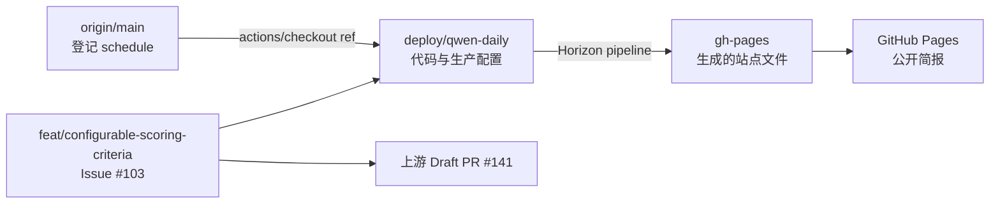

# Horizon Fork 项目状态与维护交接

> 维护对象：[`zlang8962-art/Horizon`](https://github.com/zlang8962-art/Horizon)
> 上游仓库：[`Thysrael/Horizon`](https://github.com/Thysrael/Horizon)
> 最后现场核实：2026-07-27 11:35（Asia/Shanghai）
> 当前生产分支：`deploy/qwen-daily`

以后接手本项目时，请先完整阅读本文件，再查看 `README_zh.md`、
`CONTRIBUTING.md`、相关配置和实时 Git/GitHub 状态。本文记录的是核实时的
快照，提交号、PR 状态、Actions 状态和上游差异都可能继续变化，不能代替
新的只读检查。

严禁在本文、Git、Actions 日志、Issue 或 PR 中记录 API Key 明文。本文只记录
Secret 名称。

## 1. 当前结论

| 项目 | 当前状态 | 证据/入口 |
|---|---|---|
| 每日简报工作流 | `active` | [Daily Horizon Summary](https://github.com/zlang8962-art/Horizon/actions/workflows/daily-summary.yml) |
| 自动运行时间 | 每天 23:15 UTC，即北京时间次日 07:15 | `origin/main:.github/workflows/daily-summary.yml` |
| 实际运行代码 | `deploy/qwen-daily`；本次真实运行检出 `d937393a9fb0f2a046f325a30bf27583031fb54f` | run #30234414815 的 Checkout 日志 |
| 模型服务 | Aliyun DashScope，`qwen3.7-plus` | `data/config.github.json` |
| 用户 Secret | `DASHSCOPE_API_KEY` | GitHub Actions repository secret，仅核实名称 |
| 信息源规模 | GitHub 10 项；RSS 13 项（启用 12）；另有 HN、Reddit、Telegram、OSS Insight | `data/config.github.json -> sources` |
| 线上当前筛选 | 5 个兴趣维度、`any` 模式、来源分类配额、最终最多 12 条 | `origin/deploy/qwen-daily:data/config.github.json -> filtering` |
| 个性化筛选版本 | 配置提交 `a817bc3085630cfb31a3c285a7da344fbb3f0bbe`；2026-07-27 部署 | 状态文件提交紧随配置提交，不改变运行逻辑 |
| Webhook | 关闭 | `data/config.github.json -> webhook.enabled: false` |
| LWN 订阅源 | 关闭 | `data/config.github.json -> sources.rss[name=LWN.net].enabled: false` |
| Pages | `built`，HTTPS 开启 | [简报首页](https://zlang8962-art.github.io/Horizon/) |
| 最近手动运行 | 2026-07-27 成功；37 条候选、22 条命中、最终 10 条、189,217 Token | [run #30234414815](https://github.com/zlang8962-art/Horizon/actions/runs/30234414815) |
| Issue #103 功能 | 已实现，等待上游审阅 | [上游 Draft PR #141](https://github.com/Thysrael/Horizon/pull/141) |
| 最近自动定时运行 | 2026-07-26、2026-07-27 均成功 | [run #30180747028](https://github.com/zlang8962-art/Horizon/actions/runs/30180747028)、[run #30226855537](https://github.com/zlang8962-art/Horizon/actions/runs/30226855537) |

## 2. 仓库与分支拓扑



### 远程身份

- `origin`：`https://github.com/zlang8962-art/Horizon.git`
- `upstream`：`https://github.com/Thysrael/Horizon.git`
- Fork 默认分支：`main`

### 关键分支

| 分支 | 作用 | 核实提交 |
|---|---|---|
| `origin/main` | GitHub 默认分支；登记自动定时工作流 | `f03016c72c6e826e5bc37cdf2cb0d00cced2e98c` |
| `origin/deploy/qwen-daily` | 实际运行代码、Qwen 配置、个性化筛选与 Pages 部署逻辑 | 本次运行检出 `d937393a9fb0f2a046f325a30bf27583031fb54f`；配置提交 `a817bc3085630cfb31a3c285a7da344fbb3f0bbe` |
| `origin/gh-pages` | Actions 自动生成的站点产物；不要手工编辑 | `2d5df98ab08fee290b0f5218a69d188ba7d6159e` |
| `origin/feat/configurable-scoring-criteria` | Issue #103 功能开发与上游 PR 来源 | `0bc408ae314b35fd3b84da94e3e9c363f2a96b78` |
| `origin/agent/enable-daily-summary` | 已合并 PR #2 的审计分支 | `7afd981b30d0823df9ab237aeed7b85fa8aee9a0` |

核实时，`origin/main` 相对 `upstream/main` 为：

- Fork 独有：4 个提交；
- 落后上游：49 个提交；
- 上游核实提交：`1e2fdc7ccb177f33c59aef2082c4093e1e82b22c`。

这是有意保留的历史状态。不要用 `git reset --hard`、强制 Push 或重写
`main` 来“对齐”上游。需要升级时，应在独立集成分支合并上游并完整验证。

本地 `main` 仍停在旧提交 `7a8e6a3`，比远程 `origin/main` 落后 4 个提交。
本次个性化筛选在独立分支 `codex/personalize-filtering-rules` 实施，基线为
`origin/deploy/qwen-daily@1616a9c4288d9ace8a9c94ea2d1a3be51414be43`，经用户
明确批准后以非强制快进方式部署。当前线上使用 5 个兴趣维度和最终 12 条上限。
不要把本地 `main` 或本文中的旧快照当成远程现状。

## 3. 自动化如何工作

### 定时定义的唯一有效来源

GitHub 的 `schedule` 事件只读取默认分支，因此自动运行的有效定义是：

```text
origin/main:.github/workflows/daily-summary.yml
```

不要根据当前检出的 `deploy/qwen-daily:.github/workflows/daily-summary.yml`
判断实际定时时间；该分支中的工作流副本不是 GitHub 定时触发的来源。

远程 `main` 当前配置：

```yaml
on:
  schedule:
    - cron: "15 23 * * *"
  workflow_dispatch:
```

含义：

- 每天 23:15 UTC 发起；
- 对应北京时间次日 07:15；
- 选择第 15 分钟是为了避开 GitHub Actions 整点高负载；
- GitHub 仍可能延迟排队，不能把 07:15 当成严格的完成时间。

官方规则：
[Events that trigger workflows - schedule](https://docs.github.com/en/actions/reference/workflows-and-actions/events-that-trigger-workflows#schedule)。

### 运行路径

1. 默认分支上的工作流被定时或手动触发；
2. `actions/checkout@v6` 显式检出 `deploy/qwen-daily`；
3. 安装 Python 3.12、`uv 0.11.26` 和锁定依赖；
4. 将 `data/config.github.json` 复制为运行时 `data/config.json`；
5. 仅向 Horizon 注入 `DASHSCOPE_API_KEY`；
6. 执行 `uv run horizon --hours 24`；
7. 将 `docs/` 发布到 `gh-pages`；
8. GitHub Pages 从 `gh-pages` 根目录构建站点。

`GITHUB_TOKEN` 是 GitHub 自动提供、用于写入 `gh-pages` 的内置令牌，不是
用户需要额外维护的模型 API Key。

### 重要依赖关系

- 不要删除或改名 `deploy/qwen-daily`，否则自动工作流无法检出代码；
- 不要手工修改 `gh-pages`，下一次部署可能覆盖手工内容；
- 修改 `deploy/qwen-daily` 会影响下一次自动运行，应先手动验证；
- 修改非默认分支中的 cron 不会改变真正的定时计划；
- 要改变定时计划，必须通过独立分支/PR 更新 `origin/main` 上的工作流。

## 4. 生产配置

配置文件：

```text
data/config.github.json
```

当前关键值：

| 字段 | 当前值 |
|---|---|
| `ai.provider` | `ali` |
| `ai.model` | `qwen3.7-plus` |
| `ai.base_url` | `https://dashscope.aliyuncs.com/compatible-mode/v1` |
| `ai.api_key_env` | `DASHSCOPE_API_KEY` |
| `ai.max_tokens` | `8192` |
| `filtering.ai_score_threshold` | `8.0`（自定义维度启用时仅保留为兼容字段，不参与判定） |
| `filtering.filter_mode` | `any` |
| `filtering.score_criteria` | 5 个：AI/算力、软件构建、系统安全、芯片硬件、可操作价值 |
| `filtering.time_window_hours` | `24` |
| `filtering.max_items` | `12` |
| `filtering.category_groups` | 4 组来源分类配额；其他来源最多 2 条 |
| GitHub 来源 | 10 项（1 个用户事件、9 个项目 Release） |
| RSS 来源 | 13 项，其中 12 项启用、LWN 关闭 |
| OSS Insight | 启用；24 小时、最多 12 项、最低 30 Stars、关键词过滤 |
| `webhook.enabled` | `false` |
| LWN `enabled` | `false` |

上表描述的是远端 `deploy/qwen-daily` 的当前生产配置。个性化运行逻辑来自配置
提交 `a817bc3085630cfb31a3c285a7da344fbb3f0bbe`；紧随其后的状态文件提交只记录
部署事实，不改变运行逻辑。

### 旧筛选链（2026-07-27 个性化部署前）

1. **时间范围**：只处理运行时点向前 24 小时内的内容。
2. **来源内预筛选**：
   - Hacker News：读取 Top 30，社区分数至少 150；
   - Reddit：`MachineLearning` 与 `LocalLLaMA`，`hot/day`，每个最多 10 条，
     社区分数至少 60，并读取最多 10 条评论；
   - Telegram：`zaihuapd`，最多 20 条；
   - OSS Insight：`past_24_hours`、全部语言，按 AI/LLM、推理、Agent、
     编译器、分布式系统、安全、可观测性等关键词匹配，最低 30 Stars，
     最多 12 条；
   - GitHub 项目 Release、用户事件和启用的 RSS 均继续受 24 小时时间窗约束。
3. **跨来源合并**：先合并指向相同 URL 的重复内容。
4. **AI 评分**：Qwen 对每条候选给出 0-10 分重要性评分，综合考虑技术深度与
   新颖性、潜在影响、写作/呈现质量、与软件工程、AI/ML、系统研究的相关性，
   以及社区讨论和互动信号。
5. **通过门槛**：`ai_score >= 8.0`，等于 8.0 也通过；未评分、字段无效或模型
   输出解析失败的条目会记录 `ai_analysis_error` 并明确排除，不会静默记为 0 分。
6. **主题去重**：对通过门槛的内容再做语义主题去重，只保留同一事件的主要条目。
7. **最终数量**：当前没有配置 `max_items` 或分类配额，因此主题去重后不再按
   固定总数截断；实际发布条数取决于当天达到 8 分的内容数。

### 当前个性化筛选链

来源内预筛选、24 小时时间窗、跨来源 URL 合并和主题去重保持不变。AI 判定改为
同时输出以下 5 个独立分数：

| 维度 | 通过门槛 | 个性化重点 |
|---|---:|---|
| `ai_compute` | `>= 8.0` | AI/ML 模型、Agent、训练与推理、评测与安全、开源模型生态和算力基础设施 |
| `software_building` | `>= 8.0` | 软件工程、开发工具、语言与框架、开源发布、移动/Web、local-first 与数据型应用、可维护工作流 |
| `systems_security` | `>= 8.0` | Windows/Linux、系统排障、云原生与分布式系统、网络、可观测性、可靠性、性能、安全、隐私与数据保护 |
| `chips_hardware` | `>= 8.0` | 半导体、GPU/AI 加速器、内存与互连、架构、制造和软硬件协同 |
| `practical_value` | `>= 8.5` | 可复现、有证据、说明权衡且保护数据的排障、维护、迁移、安全或改进方法；压低泛泛建议和推广内容 |

候选使用 `filter_mode: any`：任一维度达到自己的门槛即可保留，等于门槛也通过；
用于排序和展示的聚合 `ai_score` 取 5 个维度中的最高分。模型缺少、多出或返回
无效维度时，该条目保持未评分，记录 `ai_analysis_error` 并明确排除。

主题去重后再按**来源分类**执行配额（不是按上述评分维度配额）：

- AI 与算力来源最多 6 条；
- 软件与开发工具来源最多 4 条；
- 系统与安全来源最多 4 条；
- 芯片与硬件来源最多 3 条；
- 未归类来源最多 2 条；
- 所有来源合计最多 12 条。

配置描述只使用一般兴趣主题，没有写入个人项目名、本地路径、设备信息或私人数据。
5 维评分会比单一评分产生略多模型输出；最终 12 条上限可以控制后续内容增强和
简报篇幅，但不会减少候选内容的第一轮评分调用。

配置说明：

- [配置指南](docs/configuration.md)
- [评分机制](docs/scoring.md)

### Secret 管理

仓库需要的用户 Secret 只有：

```text
DASHSCOPE_API_KEY
```

查看名称：

```powershell
gh secret list --repo zlang8962-art/Horizon
```

更换密钥时应在 GitHub 仓库：

```text
Settings
  -> Secrets and variables
  -> Actions
  -> Repository secrets
```

保持名称不变即可。不要把值写入 `.env` 后提交，也不要通过命令输出、截图或
PR 正文传递密钥。

## 5. Issue #103：可配置评分维度

需求：

- [Issue #103](https://github.com/Thysrael/Horizon/issues/103)
- [Draft PR #141](https://github.com/Thysrael/Horizon/pull/141)

核实时 PR #141：

- 状态：`OPEN`、`Draft`；
- 合并状态：`MERGEABLE/CLEAN`；
- Head：`0bc408ae314b35fd3b84da94e3e9c363f2a96b78`；
- GitHub 当前未报告 CI checks 或 review decision。

已实现语义：

- 未配置 `score_criteria` 或设为 `null`：保留旧提示、旧解析和
  `ai_score_threshold` 行为；
- 单一或多个维度：每个维度有稳定名称、说明和 0-10 阈值；
- `any`：任一维度分数 `>=` 对应阈值即保留；
- `all`：全部维度分数 `>=` 对应阈值才保留；
- 阈值相等视为通过；
- 显式空列表无效；
- 名称按大小写不敏感去重，并限制为稳定 ASCII 标识符；
- 阈值必须是 0-10 之间的有限数值；
- 未知过滤模式无效；
- 模型缺字段、多字段、类型错误、越界、非有限值或无效 JSON 时，条目保持
  “未评分”，记录 `ai_analysis_error` 并在过滤阶段明确排除；
- 解析或提供商失败不会被静默改成低分或 0 分。

核心文件：

```text
src/models.py
src/scoring.py
src/ai/prompts.py
src/ai/analyzer.py
src/orchestrator.py
src/mcp/service.py
tests/test_configurable_scoring.py
tests/test_analyzer.py
tests/test_mcp_service_smoke.py
docs/configuration.md
docs/scoring.md
data/config.example.json
README.md
```

## 6. 已验证的真实运行

### 个性化筛选首次真实运行

- Actions：
  [run #30234414815](https://github.com/zlang8962-art/Horizon/actions/runs/30234414815)
- 事件：`workflow_dispatch`；仅手动触发 1 次，没有重复运行；
- 触发入口：默认分支 `main@f03016c72c6e826e5bc37cdf2cb0d00cced2e98c`；
- 实际检出：`deploy/qwen-daily@d937393a9fb0f2a046f325a30bf27583031fb54f`；
- 时间：2026-07-27 03:21:30Z 至 03:30:26Z；
- 结论：`success`，Horizon 生成和 Pages 部署步骤均成功。

真实抓取结果：

| 顶层来源 | 候选数 | 现场情况 |
|---|---:|---|
| GitHub | 4 | 成功 |
| Hacker News | 11 | 成功 |
| RSS | 1 | 其余启用源在 24 小时窗内无内容或未入库；PyTorch Blog 返回 403 |
| Reddit | 7 | `MachineLearning` 通过 RSS 降级取得内容；两个旧版 HTML 请求 403，`LocalLLaMA` RSS 429 |
| Telegram | 14 | 成功 |
| OSS Insight | 0 | 请求成功，但本次没有符合来源预筛选的条目 |
| **合计** | **37** | 顶层来源没有整体失败 |

个性化筛选和生成结果：

- 37 条均进入 AI 分析，22 条命中 `any` 评分规则；
- 1 条 Hacker News 内容因模型响应缺少必填 `tags` 字段，保持未评分并带
  `ai_analysis_error`，随后被明确排除；
- 主题去重移除 1 条，剩余 21 条；
- 来源分类配额最终选出 10 条：AI 与算力 6/6，软件与开发工具 4/4，
  系统与安全 0/4，芯片与硬件 0/3，其他 0/2；
- 最终来源：GitHub 3 条、Hacker News 2 条、Reddit 2 条、RSS 1 条、
  Telegram 2 条；
- 10 条均完成背景增强，生成中英文简报；
- Token：189,217（输入 75,909，输出 113,308）。相较上一轮定时运行的
  71,945 Token，本次约为 2.63 倍；但信息源扩充和 5 维评分同时生效，不能把
  增幅只归因于其中一项。

Pages 验证：

- `gh-pages` 新提交：`2d5df98ab08fee290b0f5218a69d188ba7d6159e`；
- 修改 `_posts/2026-07-27-summary-zh.md` 和
  `_posts/2026-07-27-summary-en.md`；
- Pages 构建状态：`built`，完成于 2026-07-27 03:30:55Z；
- [2026-07-27 中文简报](https://zlang8962-art.github.io/Horizon/2026/07/27/summary-zh.html)
  已在应用内浏览器打开并核对：标题、37→10 统计和 10 条正文均正常显示；
- [2026-07-27 英文简报](https://zlang8962-art.github.io/Horizon/2026/07/27/summary-en.html)
  的远程 Markdown 和 Pages 提交已验证，未单独做浏览器视觉复核。

### 自动定时运行

- [run #30180747028](https://github.com/zlang8962-art/Horizon/actions/runs/30180747028)：
  2026-07-26 定时触发并成功；抓取和分析 28 条，2 条达到 8.0；生成中英文
  简报；使用 79,303 Token（输入 27,875，输出 51,428）。
- [run #30226855537](https://github.com/zlang8962-art/Horizon/actions/runs/30226855537)：
  2026-07-27 定时触发并成功；抓取和分析 31 条，1 条达到 8.0；生成中英文
  简报；使用 71,945 Token（输入 25,270，输出 46,675）。
- 两次运行均由默认分支的 `schedule` 触发，并显式检出
  `deploy/qwen-daily`；第二次定时运行当时生成的 Pages 提交为
  `0568c2608038f8465040b2b820dc2a7428c20923`，当前站点已由后续手动运行更新。

以上两次定时运行使用的是来源扩充前的配置。来源扩充和个性化筛选已由
run #30234414815 完成首次真实模型与 Pages 集成验证；自动 `schedule` 路径在
新配置下是否长期稳定，仍需观察后续定时运行。

### 首次手动成功运行

- Actions：
  [run #30152546088](https://github.com/zlang8962-art/Horizon/actions/runs/30152546088)
- 事件：`workflow_dispatch`
- 分支：`deploy/qwen-daily`
- 提交：`43b3c353944f0a7b4ec144dc5de671a1ea177d86`
- 时间：2026-07-25 09:16:56Z 至 09:24:26Z
- 结论：`success`

运行结果：

- 抓取 38 条；
- 合并 1 条跨来源重复，剩余 37 条；
- 9 条评分达到 8.0；
- 3 条模型响应校验失败，保持未评分并带诊断信息；
- 主题去重后发布 8 条；
- 生成中英文 Markdown；
- 成功 Push 到 `gh-pages`；
- 模型 Token：147,039
  （输入 53,304，输出 93,735；实际计费/免费额度口径以平台为准）。

生成文件包括：

```text
data/summaries/horizon-2026-07-25-zh.md
data/summaries/horizon-2026-07-25-en.md
docs/_posts/2026-07-25-summary-zh.md
docs/_posts/2026-07-25-summary-en.md
```

Pages 产物提交：

```text
ea304fdf7bb475ce41e79699a037a7f0bbe7a2c2
```

站点：

- [简报首页](https://zlang8962-art.github.io/Horizon/)
- [2026-07-25 中文简报](https://zlang8962-art.github.io/Horizon/2026/07/25/summary-zh.html)

### 首次失败及修复

- 失败运行：
  [run #30151276487](https://github.com/zlang8962-art/Horizon/actions/runs/30151276487)
- 原因：工作流把空的 `HORIZON_WEBHOOK_URL` 注入运行环境，而配置启用了
  Webhook，导致模型调用前失败；
- 修复提交：`43b3c353944f0a7b4ec144dc5de671a1ea177d86`；
- 修复：关闭 Webhook 与 LWN，工作流只保留 `DASHSCOPE_API_KEY`；
- 修复后真实运行通过。

## 7. 已执行的本地验证

2026-07-27 个性化筛选部署已完成：

- 独立分支：`codex/personalize-filtering-rules`；
- 配置提交：`a817bc3085630cfb31a3c285a7da344fbb3f0bbe`；
- 生产 JSON 解析和 Pydantic 配置加载：通过；
- 5 个评分维度名称、说明、0-10 门槛和 `any` 模式校验：通过；
- 所有已启用来源均有分类；分类配额中未发现重复归属；
- 最终上限 12 条，四组配额与其他来源上限均被配置模型正确识别；
- 配置加载、可配置评分、分析器、平衡简报与分类接线相关测试：82 项通过；
- 1 条第三方依赖弃用警告，不影响本次验证；
- `git diff --check`：通过；
- run #30234414815 已完成首次真实模型与 Pages 集成验证：37 条候选、22 条命中、
  1 条结构无效并可诊断、最终 10 条、189,217 Token；工作流成功更新
  `gh-pages`，没有修改 `main`。

2026-07-27 信息源扩充已完成：

- 生产 JSON 解析和 Pydantic 配置加载：通过；
- 配置核对：GitHub 10 项、RSS 13 项（启用 12）、OSS Insight 启用；
- 重复 URL/仓库配置检查：未发现重复；
- `git diff --check`：通过；
- 相关测试：52 项通过；
- 1 条第三方依赖弃用警告，不影响本次配置验证；
- 首轮沙箱测试受 Windows 临时目录权限影响，改用正常用户权限后同一组测试
  全部通过；该权限错误不是产品逻辑失败；
- 新增 RSS 地址、GitHub 仓库和 OSS Insight 公共接口已做可用性检查；
- run #30234414815 已验证扩充来源后的真实抓取、模型输出、Token 和 Pages 发布；
  本次抓取 37 条，其中 RSS 1 条、OSS Insight 0 条，并观察到 PyTorch Blog 403
  以及 Reddit 403/429 降级，需继续观察后续日期的覆盖面。

2026-07-25 已完成：

- `git diff --check`：通过；
- JSON 解析：通过；
- Pydantic 配置加载：通过；
- 目标测试：32 项通过；
- 扩展回归：295 项通过；
- Actions 真实模型与 Pages 集成运行：通过。

未通过/跳过：

- `tests/test_webhook.py`：20 项受本机 DNS 环境影响；
- `tests/test_extractors_trafilatura.py`：1 项受同一环境影响；
- 原因：本机把 `example.com` 解析到保留地址 `198.18.0.134`，安全校验按设计
  拒绝访问；
- Ruff：本地环境未安装，未额外引入依赖，故跳过。

这些环境失败不能写成“全套测试通过”。重新验证时应区分产品逻辑失败和本机
DNS/网络策略影响。

常用检查：

```powershell
uv sync --extra dev
uv run pytest
git diff --check
git status --short --branch
```

如果只改文档或工作流，应运行与改动风险相称的检查；如果修改评分、配置加载、
解析或过滤逻辑，应至少运行相关单测和完整测试集。

## 8. 日常维护 SOP

### 8.1 每次接手先获取新证据

```powershell
Get-Location
git rev-parse --show-toplevel
git branch --show-current
git status --short --branch
git remote -v
git fetch origin
git fetch upstream
git rev-list --left-right --count origin/main...upstream/main
gh auth status
gh secret list --repo zlang8962-art/Horizon
gh workflow view daily-summary.yml --repo zlang8962-art/Horizon --ref main --yaml
gh run list --repo zlang8962-art/Horizon --workflow daily-summary.yml --limit 5
```

如果存在未提交或未跟踪内容，先说明并保护，不得执行 `git clean`、
`git reset --hard` 或覆盖文件。

### 8.2 修改生产代码或配置

推荐流程：

1. 从当前已验证基线创建独立分支；
2. 只修改任务范围内文件；
3. 校验 JSON、Pydantic 配置、单测和 `git diff --check`；
4. 核对工作流只引用预期 Secret；
5. 在得到明确授权后 Push；
6. 在得到明确授权后手动运行 Actions；
7. 检查日志中的抓取数、去重数、未评分数、发布数、Token 和 Pages 部署；
8. 成功后再更新自动工作流所检出的分支或提交；
9. 更新本文的提交号、验证记录、风险和未验证项。

手动运行会调用真实模型并消耗 Token，属于外部且可能产生费用的操作，必须先
得到明确批准：

```powershell
gh workflow run daily-summary.yml `
  --repo zlang8962-art/Horizon `
  --ref deploy/qwen-daily
```

### 8.3 修改自动运行时间

必须修改 Fork 默认分支 `main` 上的：

```text
.github/workflows/daily-summary.yml
```

建议通过独立分支和 Fork 内部 PR 更新，不要直接重写 `main`。修改后核对：

- cron 和注释一致；
- UTC 与北京时间换算正确；
- 避开整点；
- `checkout.ref` 仍指向已验证的部署分支；
- 工作流 API 状态仍为 `active`；
- 没有意外触发重复模型调用。

### 8.4 同步上游

不要把落后提交数直接当成“必须强制对齐”的理由。推荐：

1. `git fetch upstream`；
2. 从最新 `upstream/main` 创建新的集成/部署候选分支；
3. 移植 Fork 的配置和功能提交；
4. 解决冲突并完整测试；
5. 手动 Actions 验证；
6. 再通过小范围 PR 更新默认工作流所检出的分支。

不要强制更新、重写或重置 Fork 的 `main`。

### 8.5 暂停自动运行

优先采用可恢复方式：

- 在 GitHub Actions 页面禁用该工作流；或
- 通过 PR 从 `main` 工作流移除/注释 `schedule`，保留
  `workflow_dispatch`。

禁用工作流、修改权限、删除分支或删除 Pages 都属于外部状态变更，执行前必须
得到明确授权。

## 9. 故障排查

| 现象 | 优先检查 | 已知处理 |
|---|---|---|
| 没有按时启动 | `main` 上是否有 `schedule`、工作流是否 `active`、Actions 是否启用 | GitHub 可能延迟；先看 Actions 运行历史，不要重复手动触发 |
| 模型 401/403 | `DASHSCOPE_API_KEY` 名称、有效期、权限和额度 | 只在 GitHub Secret 中轮换，不输出旧值 |
| 找不到配置 | `Prepare GitHub Actions config` 是否执行 | 应把 `data/config.github.json` 复制为 `data/config.json` |
| Webhook URL 错误 | `webhook.enabled` 和工作流环境变量 | 当前应保持 `false`，除非另行配置并批准 Webhook |
| LWN URL/Key 错误 | LWN RSS 是否启用、是否存在 `LWN_KEY` | 当前应保持关闭 |
| Reddit 403/429 | Reddit HTML/JSON/RSS 日志 | 已观察到部分降级；其他来源仍可继续，不要把部分失败写成全流程失败 |
| 模型字段缺失/格式错误 | `ai_analysis_error`、未评分计数 | 不得改成 0 分；应保持可诊断并明确排除 |
| Pages 404 | Pages 状态、来源分支、`gh-pages` 文件 | 当前来源应为 `gh-pages` 根目录，状态应为 `built` |
| Git Push 报 `schannel ... handshake` | GitHub API 是否正常、代理、Git SSL 后端 | 已验证可用一次性 `git -c http.sslBackend=openssl push ...`；不要先改全局配置 |

## 10. 已知限制与待办

1. `schedule` 已在 2026-07-26、2026-07-27 连续成功两次；扩充信息源和个性化
   筛选已通过一次手动真实运行，但尚未经过新配置下的定时运行，需观察下一次
   `schedule` 的候选量、Token、错误率和 Pages 结果。
2. 真实模型调用已通过两次手动运行和两次定时运行，但 API 可用性、额度和输出
   格式仍会随服务状态变化。
3. Reddit 旧版 HTML 对两个子版块均返回 403；本次 `MachineLearning` 可通过 RSS
   降级取得 7 条，但 `LocalLLaMA` RSS 返回 429，覆盖并不完整。
4. 首次旧配置手动运行有 3 条结构校验失败；本次个性化运行有 1 条因缺少
   `tags` 被排除。当前行为可诊断且没有误当成低分，但应持续观察 5 维输出稳定性。
5. 邮件、飞书、Webhook 和 LWN 当前未启用，也未做真实发送验证；定时任务已
   连续成功两次，但长期稳定性仍需持续观察。
6. `docs/_config.yml` 仍有：

   ```yaml
   url: "https://thysrael.github.io"
   baseurl: "/Horizon"
   ```

   `baseurl` 对 Fork 正确，但 `url` 仍是上游域名，可能影响 RSS、canonical 或
   其他绝对链接。首页相对链接可用，但后续应在独立变更中修正并验证。
7. 自动工作流检出的是可变分支 `deploy/qwen-daily`；该分支被删除或未经验证
   地更新都会影响下一次运行。
8. 本地仍有两个未跟踪、权限受限的 pytest 临时目录：

   ```text
   pytest-cache-files-l_g9nnh5
   pytest-cache-files-y__gwayz
   ```

   它们未提交，也未删除。清理前必须核对精确路径并获得明确批准。
9. 上游 PR #141 当前为 Draft 且没有 CI checks；不能因为 `MERGEABLE` 就认为
   已获得上游审阅或合并许可。
10. 2026-07-27 中文页面已由应用内浏览器复核标题、统计和正文；英文页面已验证
    远程 Markdown 与 Pages 提交，但未单独做视觉复核。
11. 信息源扩充和 5 维评分同时生效后，本次使用 189,217 Token，是上一轮定时
    运行的约 2.63 倍；OSS Insight 已限制为最多 12 条且本次返回 0 条，高流量且
    无配置上限的 arXiv RSS 仍未启用。一次样本不能代表长期成本。
12. 最终 12 条上限只限制主题去重后的内容增强和简报条数，不限制第一轮候选
    评分；本次 21 条去重后候选因分类配额只入选 10 条。后续应重点观察配额是否
    长期压制系统、安全或芯片内容，以及 `ai_analysis_error` 数量和 Token 波动。

## 11. 关键提交与 PR

| 对象 | 标识 | 作用 |
|---|---|---|
| Issue #103 功能提交 | `0bc408ae314b35fd3b84da94e3e9c363f2a96b78` | 可配置评分维度、`any/all`、解析和测试 |
| Qwen 部署初始提交 | `251cadb` | DashScope/Qwen 生产配置与工作流 |
| 可选集成修复 | `43b3c353944f0a7b4ec144dc5de671a1ea177d86` | 关闭 Webhook/LWN，只保留 DashScope Secret |
| 信息源扩充 | `fcf236d8a3d2979d952f932749f7af733a813d30` | 新增官方 RSS、关键项目 Release 与有限流的 OSS Insight 趋势源 |
| 个性化筛选 | `a817bc3085630cfb31a3c285a7da344fbb3f0bbe` | 5 个兴趣维度、`any` 模式、来源分类配额与最终 12 条上限；已部署 |
| 自动任务提交 | `7afd981b30d0823df9ab237aeed7b85fa8aee9a0` | 默认分支登记每日 07:15 自动任务 |
| Fork PR #2 合并提交 | `f03016c72c6e826e5bc37cdf2cb0d00cced2e98c` | 启用自动运行 |
| 上游 PR | [#141](https://github.com/Thysrael/Horizon/pull/141) | Issue #103 Draft PR |
| Fork 自动化 PR | [#2](https://github.com/zlang8962-art/Horizon/pull/2) | 已合并 |

## 12. 完成维护后的更新要求

每次有意义的维护后更新本文件：

- 本文件已纳入版本控制；有意义的代码、配置、自动化或部署维护应同步更新；
- 更新“最后现场核实”时间；
- 更新关键远程提交和领先/落后数；
- 记录通过、失败、跳过及未验证检查；
- 记录新的 Actions run、Pages 状态和 Token 使用；
- 明确是否有未提交/未跟踪内容；
- 把已解决事项从“待办”移除，并补充新的风险；
- 不记录任何 Secret 值、认证令牌、个人数据或网页一次性验证码；
- 未经明确批准，不 Push、不创建/合并 PR、不发布、不删除分支。
